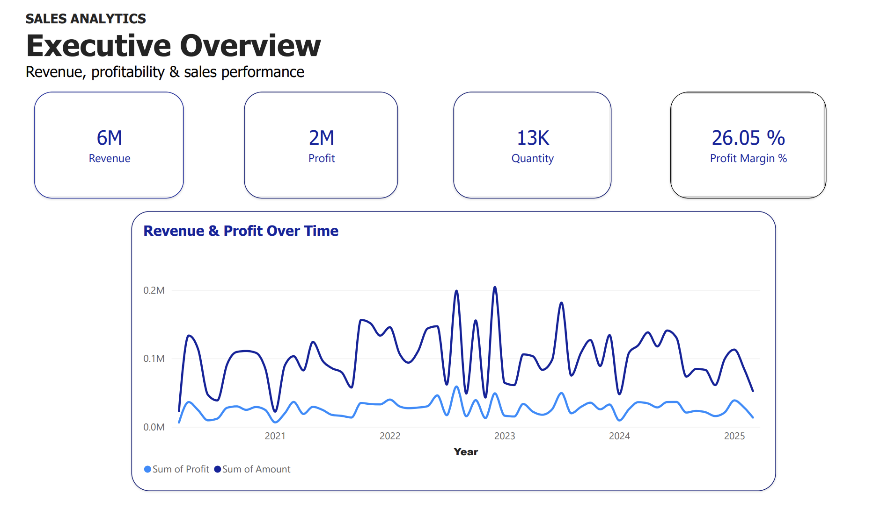
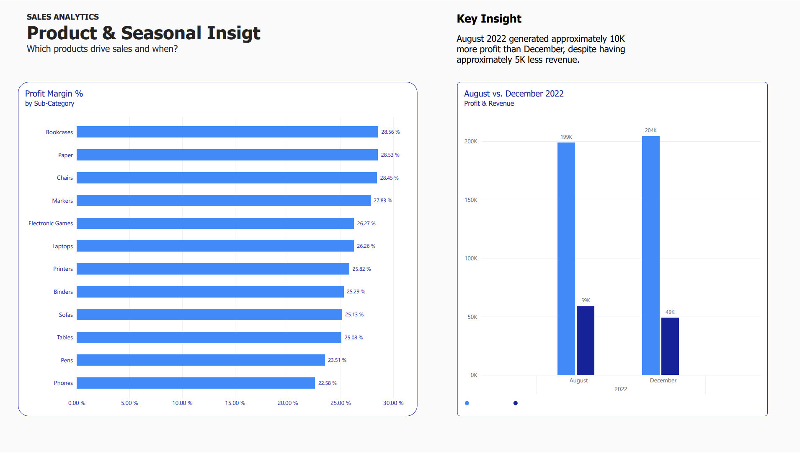
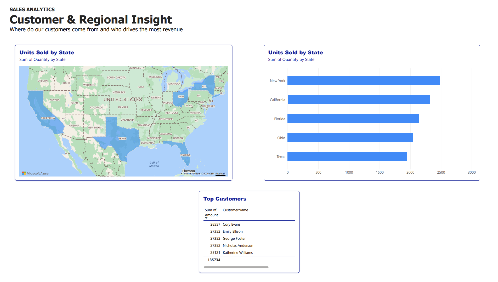
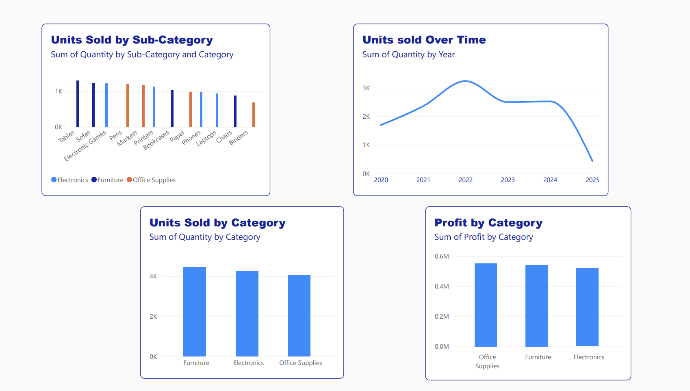

## Power BI Dashboards

The Power BI report contains four pages, each focusing on a different aspect of business performance.

### 1. Executive Overview

An interactive overview of the company's sales and profitability.

The dashboard includes:

- Total Revenue
- Total Profit
- Total Units Sold
- Overall Profit Margin
- Revenue & Profit Over Time

The line chart allows users to explore how revenue and profit change across reporting periods.

### 2. Product & Seasonal Insight

This page explores product profitability and compares the performance of August and December 2022.

It includes:

- Profit Margin by Subcategory
- August vs. December 2022 revenue and profit comparison
- A key business insight summarizing the monthly differences

### 3. Customer & Regional Insight

This page focuses on geographical sales distribution and customer spending.

It includes:

- An interactive U.S. map of units sold by state
- Top 5 States by Units Sold
- Top 5 Customers by Revenue

### 4. Additional Sales Analysis

Additional visualizations provide a broader overview of product and sales performance.

This page includes:

- Units Sold by Subcategory
- Units Sold by Category
- Units Sold Over Time
- Profit by Category

---

## Key Findings

### 1. Higher Revenue Does Not Always Mean Higher Profit

The analysis revealed an interesting difference between August and December 2022.

| Metric | August 2022 | December 2022 |
|---|---:|---:|
| Revenue | 198,965 | 204,413 |
| Profit | 58,918 | 48,915 |
| Profit Margin | 29.61% | 23.93% |

December generated 5,448 more in revenue, while August generated 10,003 more in profit.

This illustrates why revenue should be evaluated alongside profit and profit margin when assessing business performance.

### 2. Product Profitability Varies Across Subcategories

The SQL analysis showed differences in profitability across the 12 product subcategories.

Bookcases achieved the highest overall profit margin at approximately 28.56%, while Phones recorded the lowest at approximately 22.58%.

This highlights the importance of considering profitability rather than focusing exclusively on sales revenue.

### 3. Category-Level Differences Contributed to Monthly Profitability

Further analysis of August and December 2022 showed differences in category-level profits.

| Category | August Profit | December Profit |
|---|---:|---:|
| Electronics | 7,856 | 17,603 |
| Furniture | 19,956 | 14,814 |
| Office Supplies | 31,106 | 16,498 |

Office Supplies and Furniture generated more profit in August, while Electronics generated more profit in December.

These category-level differences contributed to August's higher overall profit.

The dataset does not establish the underlying causes of these differences. Further information about pricing, costs and promotional activity would be needed to investigate them.

### 4. Regional Sales Performance

The regional analysis identified New York and California as the leading states by units sold in the dashboard's state comparison.

The interactive map provides an additional geographical view of sales distribution.

---

## Business Implications

The findings identify several opportunities for further investigation:

- Examine subcategories with lower profit margins.
- Investigate the differences between high-revenue and high-profit periods.
- Explore how product mix, pricing and costs influence profitability.
- Use geographical and customer insights to support future sales analysis.

## What I Learned

Through this project, I strengthened my SQL skills in data exploration, aggregation, grouping, filtering and calculating business metrics.

I also gained hands-on experience using Power BI to turn SQL findings into interactive dashboards.

Most importantly, the project helped me develop a more business-oriented approach to data analysis by moving beyond descriptive statistics and examining what the results could mean for business decisions.

---

## Project Files

- `sales_analytics.sql` — SQL queries used throughout the project
- `executive-overview.png` — Executive dashboard
- `product-seasonal.png` — Product profitability and monthly comparison
- `customer-regional.png` — Regional and customer analysis
- `additional-analysis.png` — Additional sales visualizations
